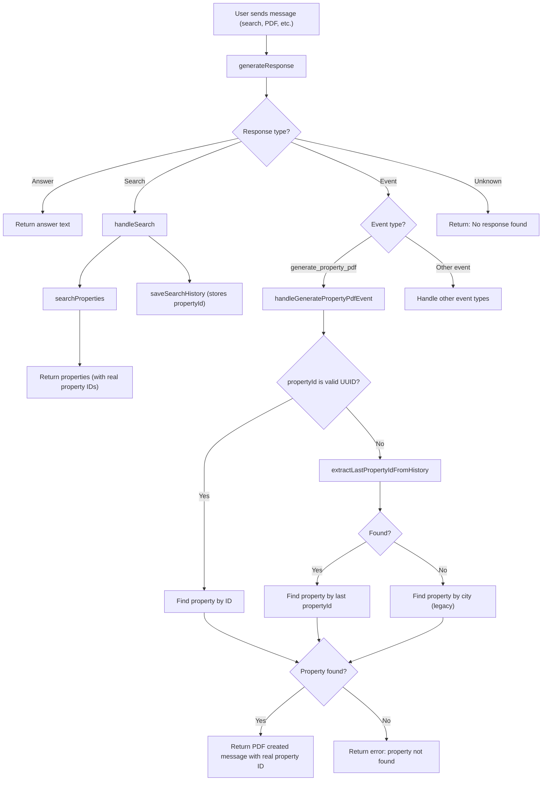

# AI Module Structure

This folder contains the AI integration logic for real estate message processing. The code is organized for maintainability and testability.

## Structure

- `types/` — TypeScript types and interfaces for the AI module
- `utils/` — Utility functions and mappings (e.g., language detection, type mapping)
- `services/` — Service classes for OpenAI integration and response parsing
- `processRealEstateMessage.ts` — Main orchestrator function for processing messages
- `index.ts` — Barrel export for all module features

## Usage

Import the main function or any class/type as needed:

```ts
import { processRealEstateMessage, OpenAIServiceImpl, ResponseParserImpl } from './ai';
```

## Testing

Use `createMockServices` from `processRealEstateMessage.ts` for mocking in tests. 

# Real Estate AI Message Flow



---

This chart shows the main flow from user message to PDF generation, including all key decision points and how property IDs are handled for robust, type-safe processing. 